# Entity Model: Staff and Users

## Overview

This model distinguishes between **Staff** (actively working employees) and **Users** (staff with app access).

## Key Principle

**Every User IS a Staff Member** - but not every Staff Member has a User account.

## Entity Relationship Diagram

### High-Level Relationship

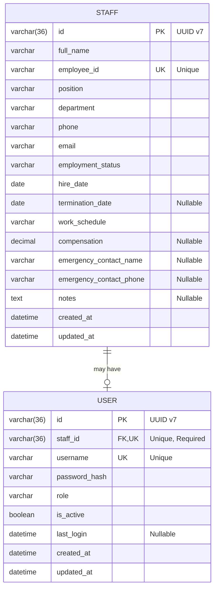

### Detailed Entity Diagram with Constraints

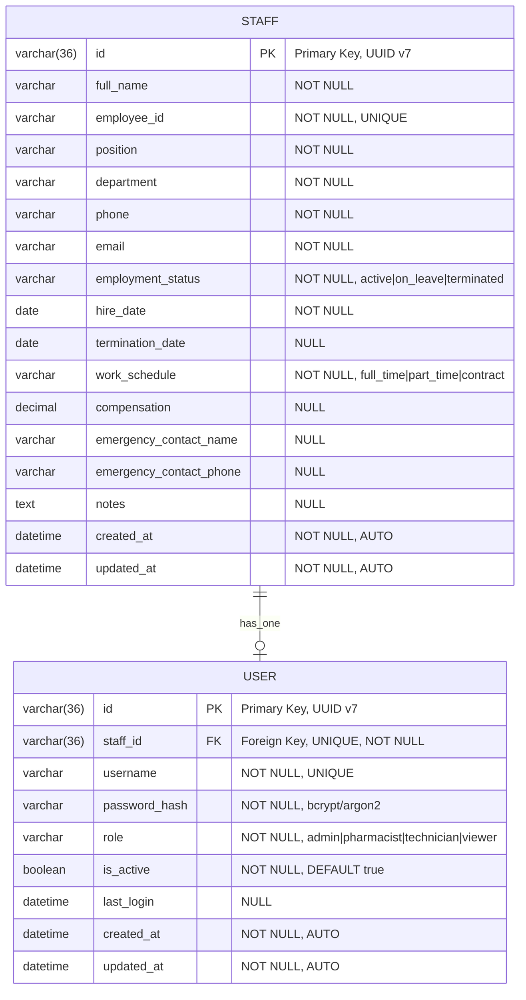

### Cardinality Visualization

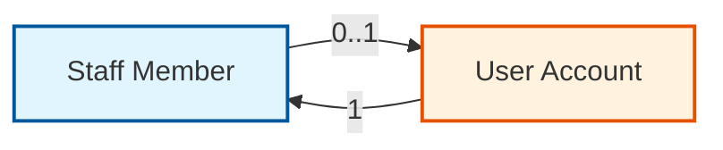

### Data Flow Diagram

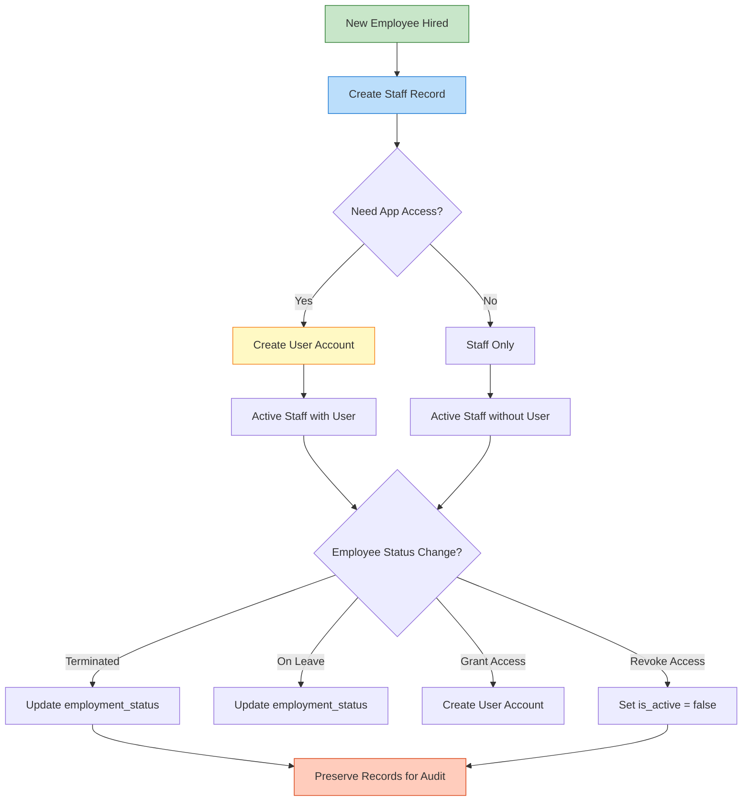

### Use Case Scenarios

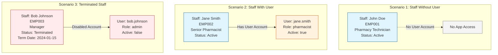

### Database Schema with Indexes

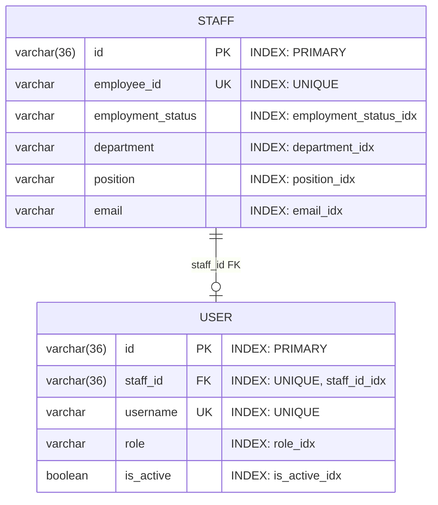

## Entities

### Staff Entity (Base)

Represents all actively working employees in the pharmacy.

**Attributes:**

- `id` - Primary key (UUID v7)
- `full_name` - Employee's full name
- `employee_id` - Unique employee/badge number (UNIQUE)
- `position` - Job title (Pharmacist, Technician, Manager, etc.)
- `department` - Department (Pharmacy, Administration, etc.)
- `phone` - Contact phone number
- `email` - Contact email address
- `employment_status` - **ENUM**: `Active`, `OnLeave`, `Terminated`
- `hire_date` - Date of employment start
- `termination_date` - Date of employment end (if applicable)
- `work_schedule` - **ENUM**: `FullTime`, `PartTime`, `Contract`
- `compensation` - Salary or hourly rate (optional)
- `emergency_contact_name` - Emergency contact person (optional)
- `emergency_contact_phone` - Emergency contact number (optional)
- `notes` - Additional information (optional)
- `created_by` - User ID who created this record (optional, for audit)
- `updated_by` - User ID who last modified this record (optional, for audit)
- `created_at` - Record creation timestamp (timezone-aware)
- `updated_at` - Last update timestamp (timezone-aware, auto-updated)
- `deleted_at` - Soft deletion timestamp (timezone-aware, NULL = not deleted)

**Purpose:**

- Track all employees regardless of app access
- Maintain employment records
- Store HR-related information
- Manage work schedules and compensation
- Preserve historical data through soft deletion

**Enums:**

```rust
pub enum EmploymentStatus {
    Active,      // Currently employed
    OnLeave,     // Temporarily away
    Terminated,  // No longer employed
}

pub enum WorkSchedule {
    FullTime,    // Full-time employee
    PartTime,    // Part-time employee
    Contract,    // Contract worker
}
```

### User Entity (Authentication Layer)

Represents staff members who have been granted app access.

**Attributes:**

- `id` - Primary key (UUID v7)
- `staff_id` - **Required** foreign key to Staff (UNIQUE, one-to-one)
- `username` - Unique login username (UNIQUE)
- `email` - Unique email address for login (UNIQUE)
- `password_hash` - Hashed password for authentication (bcrypt/argon2)
- `first_name` - User's first name
- `last_name` - User's last name
- `display_name` - Display name (can be different from first+last, optional)
- `avatar_url` - Profile avatar URL or path (optional)
- `npi_number` - NPI (National Provider Identifier) for healthcare providers (optional)
- `supervisor_id` - Foreign key to another User (organizational hierarchy, optional)
- `role_id` - **Required** foreign key to Role
- `status` - **ENUM**: `Active`, `Inactive`, `Suspended`, `PendingVerification`
- `is_active` - Whether the account can log in
- `last_login_at` - Last successful login timestamp (timezone-aware, optional)
- `created_by` - User ID who created this account (optional, for audit)
- `updated_by` - User ID who last modified this account (optional, for audit)
- `created_at` - Account creation timestamp (timezone-aware)
- `updated_at` - Last update timestamp (timezone-aware, auto-updated)
- `deleted_at` - Soft deletion timestamp (timezone-aware, NULL = not deleted)

**Purpose:**

- Provide app authentication
- Manage permissions through roles
- Track login activity
- Control access to system features
- Support organizational hierarchy
- Preserve account history through soft deletion

**Enums:**

```rust
pub enum UserStatus {
    Active,                // Account is active and can be used
    Inactive,             // Account is inactive but not suspended
    Suspended,            // Account is temporarily suspended
    PendingVerification,  // Account awaiting verification
}
```

### Role Entity (Permission Management)

Represents user roles and their associated permissions.

**Attributes:**

- `id` - Primary key (UUID v7)
- `name` - Unique role name (e.g., "admin", "pharmacist", "technician", "viewer") (UNIQUE)
- `display_name` - Human-readable display name
- `description` - Role description (optional)
- `level` - Permission level (higher = more permissions)
- `is_system` - Whether this is a system role (cannot be deleted)
- `is_active` - Whether this role is active
- `permissions` - JSON array of permissions
- `created_by` - User ID who created this role (optional, for audit)
- `updated_by` - User ID who last modified this role (optional, for audit)
- `created_at` - Record creation timestamp (timezone-aware)
- `updated_at` - Last update timestamp (timezone-aware, auto-updated)
- `deleted_at` - Soft deletion timestamp (timezone-aware, NULL = not deleted)

**Purpose:**

- Define user permissions
- Support role-based access control (RBAC)
- Allow flexible permission management
- Protect system roles from deletion
- Track role changes through audit fields

**Example Roles:**

```json
{
  "admin": {
    "level": 100,
    "permissions": ["*"]
  },
  "pharmacist": {
    "level": 50,
    "permissions": ["orders:*", "inventory:read", "reports:read"]
  },
  "technician": {
    "level": 30,
    "permissions": ["orders:create", "orders:read", "inventory:read"]
  },
  "viewer": {
    "level": 10,
    "permissions": ["orders:read", "reports:read"]
  }
}
```

## Relationships

```
Staff (1) ←→ (0..1) User
User (N) ←→ (1) Role
User (N) ←→ (0..1) User (Supervisor)
```

- **One Staff** can have **zero or one User** account
- **One User** must belong to **exactly one Staff** member
- **Many Users** belong to **one Role**
- **One User** may have **zero or one Supervisor** (another User)

### Relationship Details

1. **Staff ↔ User**: One-to-one relationship
   - A staff member may or may not have app access
   - Every user must be linked to a staff member
   - Enforced by unique constraint on `user.staff_id`

2. **User ↔ Role**: Many-to-one relationship
   - Multiple users can have the same role
   - Every user must have exactly one role
   - Roles define permissions and access levels

3. **User ↔ User (Supervisor)**: Self-referential relationship
   - Users can have a supervisor (another user)
   - Creates organizational hierarchy
   - Optional relationship (supervisor_id can be NULL)

## Use Cases

### Scenario 1: Staff Member Without App Access

```
Staff: John Doe
- employee_id: "EMP001"
- position: "Pharmacy Technician"
- employment_status: Active
- deleted_at: NULL
- User: NULL (no app access)
```

John works at the pharmacy but doesn't need to use the management system.

### Scenario 2: Staff Member With App Access

```
Staff: Jane Smith
- employee_id: "EMP002"
- position: "Senior Pharmacist"
- employment_status: Active
- deleted_at: NULL

User: jane.smith
- staff_id: (links to Jane Smith)
- username: "jane.smith"
- email: "jane.smith@pharmacy.com"
- first_name: "Jane"
- last_name: "Smith"
- role_id: (links to "pharmacist" role)
- status: Active
- is_active: true
- deleted_at: NULL
```

Jane works at the pharmacy AND has access to the management system with pharmacist permissions.

### Scenario 3: Terminated Staff With Disabled Account (Soft Deleted)

```
Staff: Bob Johnson
- employee_id: "EMP003"
- position: "Manager"
- employment_status: Terminated
- termination_date: 2024-01-15
- deleted_at: 2024-01-15T10:00:00Z

User: bob.johnson
- staff_id: (links to Bob Johnson)
- username: "bob.johnson"
- email: "bob@pharmacy.com"
- role_id: (links to "admin" role)
- status: Inactive
- is_active: false
- deleted_at: 2024-01-15T10:00:00Z
```

Bob no longer works here. Both his staff and user records are soft-deleted (deleted_at is set) but preserved for audit purposes.

### Scenario 4: User with Supervisor

```
Staff: Alice Manager
- employee_id: "EMP004"
- position: "Pharmacy Manager"

User: alice.manager
- staff_id: (links to Alice Manager)
- role_id: (links to "admin" role)
- supervisor_id: NULL (top of hierarchy)

Staff: Carol Pharmacist
- employee_id: "EMP005"
- position: "Pharmacist"

User: carol.pharmacist
- staff_id: (links to Carol Pharmacist)
- role_id: (links to "pharmacist" role)
- supervisor_id: (links to alice.manager)
```

Carol reports to Alice in the organizational hierarchy.

### Scenario 5: Role-Based Permissions

```
Role: Admin
- name: "admin"
- display_name: "Administrator"
- level: 100
- permissions: ["*"]
- is_system: true

Role: Pharmacist
- name: "pharmacist"
- display_name: "Pharmacist"
- level: 50
- permissions: ["orders:*", "inventory:read", "reports:read"]
- is_system: true

Role: Viewer
- name: "viewer"
- display_name: "Viewer"
- level: 10
- permissions: ["orders:read", "reports:read"]
- is_system: false
```

Different roles provide different levels of access to the system.

## Database Queries

### Get all active staff members (excluding soft-deleted)

```sql
SELECT * FROM staff
WHERE employment_status = 'active'
AND deleted_at IS NULL;
```

### Get all users with their staff and role information

```sql
SELECT u.*, s.*, r.name as role_name, r.display_name as role_display_name
FROM users u
INNER JOIN staff s ON u.staff_id = s.id
INNER JOIN roles r ON u.role_id = r.id
WHERE u.is_active = true
AND u.deleted_at IS NULL
AND s.deleted_at IS NULL;
```

### Get staff members without app access

```sql
SELECT s.*
FROM staff s
LEFT JOIN users u ON s.id = u.staff_id AND u.deleted_at IS NULL
WHERE u.id IS NULL
AND s.employment_status = 'active'
AND s.deleted_at IS NULL;
```

### Get active users with active employment

```sql
SELECT u.*, s.*
FROM users u
INNER JOIN staff s ON u.staff_id = s.id
WHERE u.is_active = true
AND u.status = 'active'
AND s.employment_status = 'active'
AND u.deleted_at IS NULL
AND s.deleted_at IS NULL;
```

### Get user with supervisor information

```sql
SELECT
    u.id, u.username, u.email,
    s.full_name as staff_name,
    sup.username as supervisor_username,
    sup_staff.full_name as supervisor_name
FROM users u
INNER JOIN staff s ON u.staff_id = s.id
LEFT JOIN users sup ON u.supervisor_id = sup.id
LEFT JOIN staff sup_staff ON sup.staff_id = sup_staff.id
WHERE u.deleted_at IS NULL;
```

### Get all users by role

```sql
SELECT u.*, s.full_name, r.display_name as role_name
FROM users u
INNER JOIN staff s ON u.staff_id = s.id
INNER JOIN roles r ON u.role_id = r.id
WHERE r.name = 'pharmacist'
AND u.deleted_at IS NULL
AND s.deleted_at IS NULL;
```

### Soft delete a user and their staff record

```sql
-- Soft delete user
UPDATE users
SET deleted_at = NOW(),
    is_active = false,
    updated_at = NOW()
WHERE id = 'user-uuid';

-- Soft delete staff
UPDATE staff
SET deleted_at = NOW(),
    employment_status = 'terminated',
    termination_date = CURRENT_DATE,
    updated_at = NOW()
WHERE id = 'staff-uuid';
```

### Restore soft-deleted records

```sql
-- Restore user
UPDATE users
SET deleted_at = NULL,
    is_active = true,
    updated_at = NOW()
WHERE id = 'user-uuid';

-- Restore staff
UPDATE staff
SET deleted_at = NULL,
    employment_status = 'active',
    termination_date = NULL,
    updated_at = NOW()
WHERE id = 'staff-uuid';
```

### Get audit trail for a user

```sql
SELECT
    u.id,
    u.username,
    creator.username as created_by_username,
    u.created_at,
    updater.username as updated_by_username,
    u.updated_at
FROM users u
LEFT JOIN users creator ON u.created_by = creator.id
LEFT JOIN users updater ON u.updated_by = updater.id
WHERE u.id = 'user-uuid';
```

## Benefits of This Model

1. **Separation of Concerns**
   - Staff entity handles HR/employment data
   - User entity handles authentication/authorization
   - Role entity handles permission management

2. **Flexibility**
   - Not all staff need app access
   - Can grant/revoke access without affecting employment records
   - Roles can be modified without changing user records

3. **Data Integrity**
   - User must reference a valid staff member
   - User must have a valid role
   - Cannot have orphaned user accounts
   - Soft deletion preserves referential integrity

4. **Audit Trail**
   - Preserve staff records even after termination
   - Track when accounts were created/disabled
   - Track who created and modified records
   - Soft deletion maintains complete history

5. **Security**
   - Separate authentication data from personal information
   - Easy to disable app access without deleting employee records
   - Role-based permissions provide fine-grained access control
   - Timezone-aware timestamps prevent timezone-related security issues

6. **Scalability**
   - Organizational hierarchy through supervisor relationships
   - Flexible permission system through JSON permissions
   - Soft deletion allows data recovery
   - Audit fields support compliance requirements

7. **Type Safety**
   - Enums for employment_status and work_schedule prevent invalid values
   - Enums for user_status ensure consistent state management
   - UUID v7 IDs provide time-ordered, globally unique identifiers

## PostgreSQL-Specific Optimizations

This entity model is optimized for PostgreSQL with native database features:

### Native Data Types

1. **UUID Type**
   - All ID fields use PostgreSQL native UUID type
   - More efficient than VARCHAR(36) for storage and indexing
   - Supports UUID v7 for time-ordered, globally unique identifiers
   - Column type: `column_type = "Uuid"`

2. **ENUM Types**
   - Employment status, work schedule, and user status use PostgreSQL ENUM types
   - More efficient than string comparisons
   - Database-level validation
   - Type-safe at both Rust and database levels
   - Examples:
     ```sql
     CREATE TYPE employment_status AS ENUM ('active', 'on_leave', 'terminated');
     CREATE TYPE work_schedule AS ENUM ('full_time', 'part_time', 'contract');
     CREATE TYPE user_status AS ENUM ('active', 'inactive', 'suspended', 'pending_verification');
     ```

3. **TIMESTAMPTZ (Timestamp with Timezone)**
   - All datetime fields use PostgreSQL TIMESTAMPTZ
   - Stores timezone information with timestamps
   - Prevents timezone-related bugs
   - Supports global deployments
   - Column type: `column_type = "TimestampWithTimeZone"`

4. **JSONB (Binary JSON)**
   - Role permissions stored as JSONB
   - More efficient than JSON for querying
   - Supports indexing and GIN indexes
   - Column type: `column_type = "JsonBinary"`

5. **TEXT vs VARCHAR**
   - TEXT: Unlimited length fields (full_name, position, department, notes, password_hash, avatar_url)
   - VARCHAR with specific lengths: Fields with known size constraints
     - email: VARCHAR(255) - email standard
     - phone: VARCHAR(20) - international phone format
     - employee_id: VARCHAR(50) - employee ID format
     - username: VARCHAR(100) - username length limit
     - npi_number: VARCHAR(10) - NPI standard length

6. **NUMERIC with Precision**
   - Compensation field uses NUMERIC(12,2)
   - Precise decimal arithmetic (no floating-point errors)
   - 12 digits total, 2 decimal places
   - Suitable for currency and financial data
   - Column type: `column_type = "Decimal(Some((12, 2)))"`

### Column Type Mapping

| Rust Type              | PostgreSQL Type     | SeaORM Annotation                         | Use Case                       |
| ---------------------- | ------------------- | ----------------------------------------- | ------------------------------ |
| `Id`                   | `UUID`              | `column_type = "Uuid"`                    | Primary keys, foreign keys     |
| `String` (unlimited)   | `TEXT`              | `column_type = "Text"`                    | Long text, notes, descriptions |
| `String` (limited)     | `VARCHAR(N)`        | `column_type = "String(StringLen::N(N))"` | Constrained text fields        |
| `EmploymentStatus`     | `employment_status` | `db_type = "Enum"`                        | Employment status enum         |
| `WorkSchedule`         | `work_schedule`     | `db_type = "Enum"`                        | Work schedule enum             |
| `UserStatus`           | `user_status`       | `db_type = "Enum"`                        | User status enum               |
| `DateTimeWithTimeZone` | `TIMESTAMPTZ`       | `column_type = "TimestampWithTimeZone"`   | All timestamps                 |
| `Date`                 | `DATE`              | Default                                   | Date-only fields               |
| `Decimal`              | `NUMERIC(12,2)`     | `column_type = "Decimal(Some((12, 2)))"`  | Currency, compensation         |
| `Json`                 | `JSONB`             | `column_type = "JsonBinary"`              | Permissions, flexible data     |
| `bool`                 | `BOOLEAN`           | Default                                   | Boolean flags                  |
| `i32`                  | `INTEGER`           | `column_type = "Integer"`                 | Integer values                 |

### Performance Optimizations

1. **Explicit Column Types**
   - All fields have explicit PostgreSQL column types
   - Optimizes storage and query performance
   - Prevents type conversion overhead

2. **Proper Indexing**
   - UUID fields indexed for fast lookups
   - ENUM fields indexed for filtering
   - TIMESTAMPTZ fields indexed for time-based queries
   - Partial indexes on `deleted_at IS NULL` for active records

3. **JSONB Indexing**

   ```sql
   CREATE INDEX idx_roles_permissions ON roles USING GIN (permissions);
   ```

4. **Nullable Annotations**
   - Explicit `nullable` annotations for optional fields
   - Prevents unnecessary NOT NULL constraints
   - Optimizes storage for sparse data

### Migration Considerations

1. **Create ENUM types first**

   ```sql
   CREATE TYPE employment_status AS ENUM ('active', 'on_leave', 'terminated');
   CREATE TYPE work_schedule AS ENUM ('full_time', 'part_time', 'contract');
   CREATE TYPE user_status AS ENUM ('active', 'inactive', 'suspended', 'pending_verification');
   ```

2. **Create tables with proper types**

   ```sql
   CREATE TABLE staff (
       id UUID PRIMARY KEY,
       employee_id VARCHAR(50) UNIQUE NOT NULL,
       employment_status employment_status NOT NULL,
       work_schedule work_schedule NOT NULL,
       compensation NUMERIC(12,2),
       created_at TIMESTAMPTZ NOT NULL,
       updated_at TIMESTAMPTZ NOT NULL,
       deleted_at TIMESTAMPTZ
   );
   ```

3. **Add indexes**
   ```sql
   CREATE INDEX idx_staff_deleted_at ON staff(id) WHERE deleted_at IS NULL;
   CREATE INDEX idx_users_deleted_at ON users(id) WHERE deleted_at IS NULL;
   CREATE INDEX idx_roles_permissions ON roles USING GIN (permissions);
   ```

## Implementation Notes

- Use `staff_id` as a unique foreign key in User entity
- Use `role_id` as a foreign key in User entity
- Enforce referential integrity at database level
- Use soft deletes for all entities (set `deleted_at` instead of DELETE)
- Index `staff_id`, `username`, `email`, `role_id`, and `employee_id` for performance
- Index `deleted_at` for efficient soft-delete queries
- Hash passwords using bcrypt or argon2
- Implement role-based access control (RBAC) using the Role entity
- Use timezone-aware timestamps (DateTimeWithTimeZone) for all datetime fields
- Auto-update `updated_at` timestamp on every modification
- Store permissions as JSONB for flexibility and query performance
- Protect system roles from deletion (`is_system = true`)
- Use enums for status fields to ensure type safety at both Rust and database levels
- Use PostgreSQL native UUID type for all ID fields
- Use appropriate VARCHAR lengths for constrained fields
- Use TEXT for unlimited length fields
- Use NUMERIC with precision for financial data

### Soft Deletion Best Practices

1. **Always check deleted_at in queries**

   ```sql
   WHERE deleted_at IS NULL
   ```

2. **Include deleted_at in indexes**

   ```sql
   CREATE INDEX idx_users_active ON users(id) WHERE deleted_at IS NULL;
   ```

3. **Cascade soft deletes**
   - When soft-deleting a staff member, also soft-delete their user account
   - When soft-deleting a role, handle users with that role appropriately

4. **Provide restore functionality**
   - Allow administrators to restore soft-deleted records
   - Validate data integrity before restoring

### Timezone Handling

1. **Always use DateTimeWithTimeZone**
   - Stores timezone information with timestamps
   - Prevents timezone-related bugs
   - Supports global deployments

2. **Convert to user's timezone for display**

   ```rust
   let user_tz = chrono_tz::America::New_York;
   let local_time = timestamp.with_timezone(&user_tz);
   ```

3. **Store in UTC internally**
   ```rust
   let utc_time = chrono::Utc::now();
   ```

### Audit Trail Usage

1. **Set created_by on insert**

   ```rust
   created_by: Some(current_user_id)
   ```

2. **Set updated_by on update**

   ```rust
   updated_by: Some(current_user_id)
   ```

3. **Query audit information**
   ```sql
   SELECT created_by, created_at, updated_by, updated_at
   FROM users WHERE id = 'user-uuid';
   ```

## Database Indexes

### Recommended Indexes

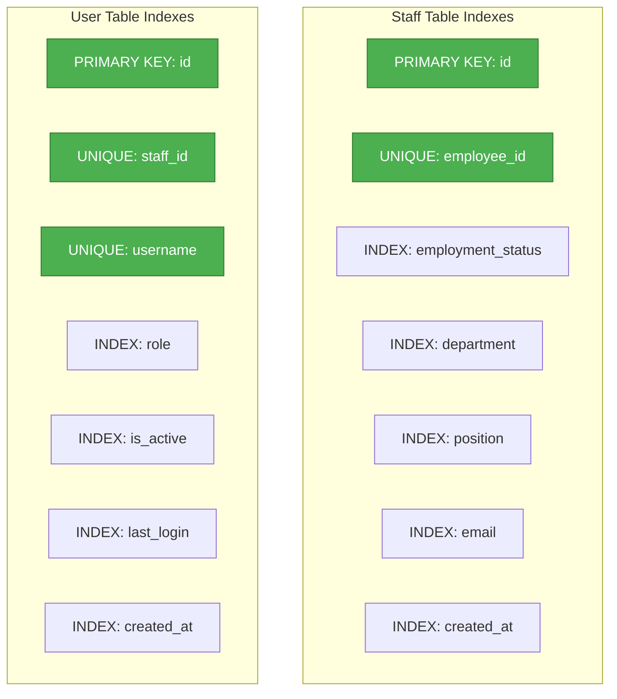

### Query Performance Optimization

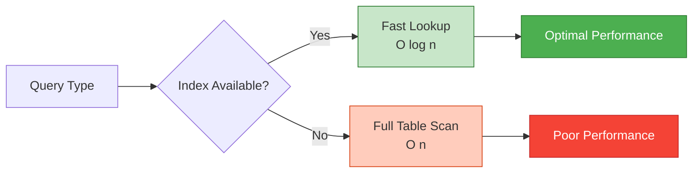

## State Transitions

### Staff Employment Status

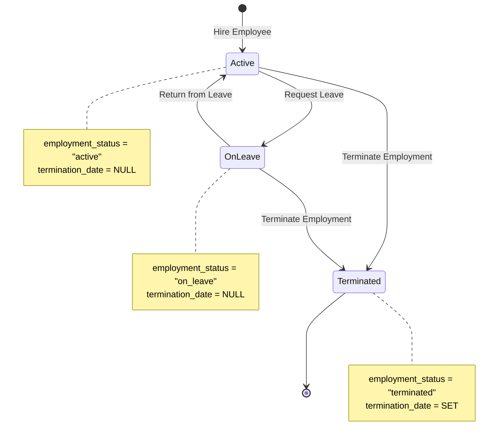

### User Account Status

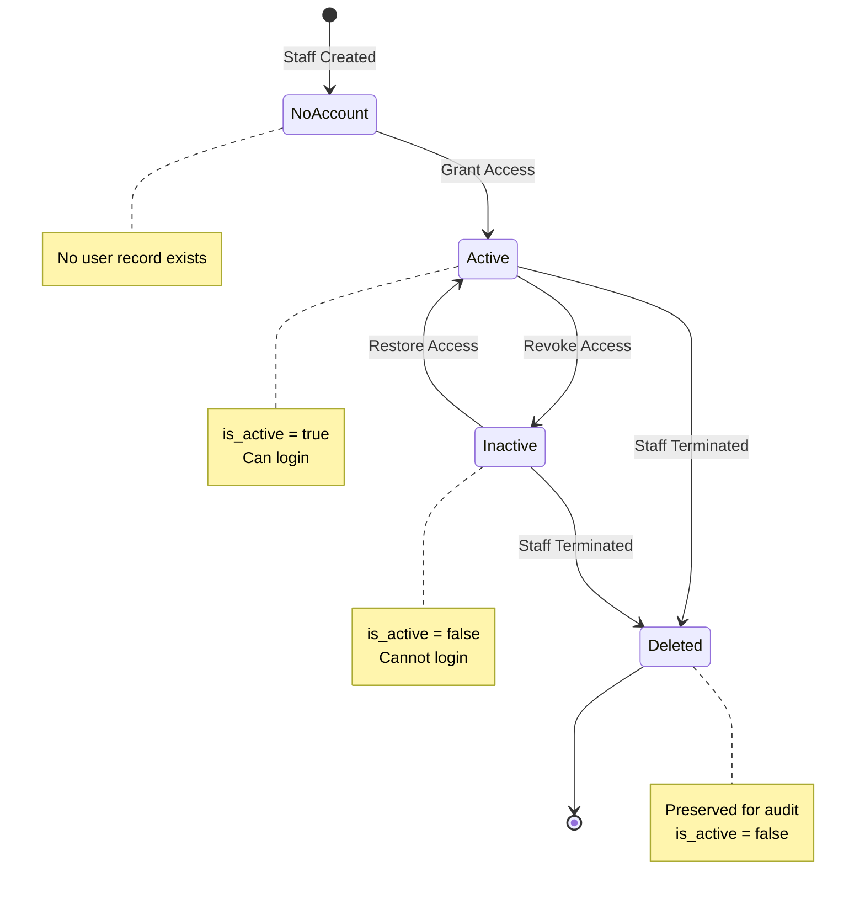

## Access Control Matrix

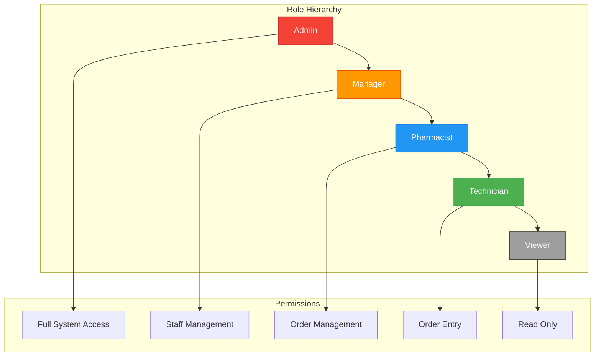

## Data Lifecycle

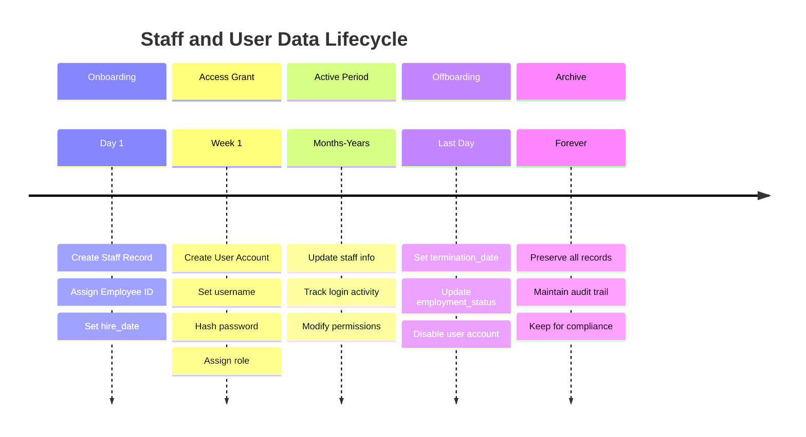
